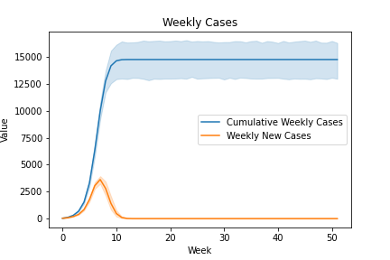

# TorchContactTracingModel
Reimplementation of Feasibility of controlling 2019-nCoV outbreaks by isolation of cases and contacts

Original paper: https://www.thelancet.com/action/showPdf?pii=S2214-109X%2820%2930074-7
Original R code: https://github.com/cmmid/ringbp

